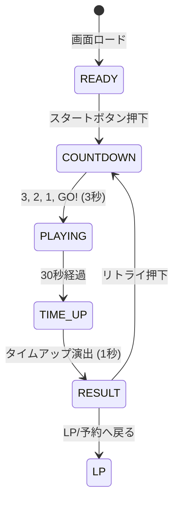

# 仕様書: 30秒アサイータワー・スタック（バランス・キャッチ）

## 1. 概要
* **ゲーム名:** 30秒アサイータワー・スタック（英名: Acai Tower Stack）
* **コンセプト:** 落ちてくる新鮮なフルーツをアサイーボウルで左右にキャッチし、30秒間でどれだけ高く豪華な「映えアサイータワー」を積み上げられるかを競うカジュアルアクションゲーム。
* **対象環境:** モバイルブラウザ（iOS Safari / Android Chrome）、PCブラウザ
* **プレイ時間:** 30秒固定

---

## 2. ゲームループ & ステートマシン



### 各ステート詳細
1. **READY（待機画面）**
   * タイトル、簡易ルール（「カップを指でスライドしてフルーツをキャッチ！」「5段で1品完成！」「推奨レシピ達成で+1200pt！」）、スタートボタンを表示。
2. **COUNTDOWN（カウントダウン）**
   * 「3」「2」「1」「GO!」をオーバーレイ表示。画面上部には最初の推奨レシピオーダーを先行表示。
3. **PLAYING（プレイ中 / 30秒）**
   * 上部からランダムなフルーツおよびお邪魔アイテムが落下。
   * 残り時間タイマーバーが減少。
   * フルーツキャッチでスコア加算＆ボウル上にスタック（積み上げ）。5段完成でトレイへ出荷＆リセット。
4. **TIME_UP（終了演出）**
   * 「TIME UP!」表示、操作および落下を停止。
5. **RESULT（結果発表）**
   * 最終スコア、完成杯数、最大コンボ、ランク、獲得クーポン、SNSシェアボタン、リトライボタンを表示。

---

## 3. 操作仕様 (Controls)

| デバイス | 操作方法 | 挙動 |
| :--- | :--- | :--- |
| **スマホ（タッチ＆スライド）** | 画面・カップをタップ / 指を左右にスライド | 指のX座標にカップ（ボウル）が1:1でダイレクト追従 |
| **PC（マウス）** | マウスクリック / カーソル左右移動 | カーソルのX座標にカップ（ボウル）がスムーズに追従 |
| **PC（キーボード）** | `←` / `→` キー または `A` / `D` キー | カップ（ボウル）が左 / 右へ移動 |

---

## 4. アイテム仕様 & 当たり判定

### 4.1 落下アイテム一覧

| アイテム | 表示 | 出現率 | 基礎得点 | 効果・特徴 |
| :--- | :---: | :---: | :---: | :--- |
| **ストロベリー** | 🍓 | 30% | 100 pt | 標準サイズ・標準落下速度 |
| **バナナ** | 🍌 | 25% | 100 pt | 横長でキャッチしやすい |
| **ブルーベリー** | 🫐 | 20% | 50 pt | 小さく落下速度がやや速い（難度高） |
| **マンゴー** | 🥭 | 10% | 200 pt | レアアイテム（高得点） |
| **グラノーラ** | 🥥 | 10% | 150 pt | ふんわり落下 |
| **ゴールドハニー** | 🍯 | 3% | 150 pt | **フィーバー効果:** 2.5秒間ボウルが少し拡大（1.15倍）＆スコア1.5倍 |
| **お邪魔カニ** | 🦀 | 2% | -200 pt | **ペナルティ:** 接触するとボウルが0.5秒スタン＆タワー最上部が崩れる |

### 4.2 当たり判定ロジック
* **当たり判定面:** ボウル最上部（スタックがある場合は現在のタワー最上段のアイテム上面）。
* **キャッチ精度判定:**
  * **PERFECT (中心 ±15%):** 基礎点 × 1.5 ＋ コンボ数+1 ＋ タワーが真っ直ぐ安定
  * **GREAT (中心 ±40%):** 基礎点 × 1.0 ＋ コンボ数+1 ＋ タワーが少し傾く
  * **MISS / DROP (範囲外):** 画面外へ落下。コンボリセット（0へ）。

---

## 5. スコアリング & ランク基準

### 5.1 スコア計算式
* `Score = Σ (基礎点 × 精度倍率 × コンボ倍率) + 一品完成ボーナス（基本 + 役ボーナス） - ペナルティ`
* **コンボ倍率:**
  * 1〜4コンボ: `x1.0`
  * 5〜9コンボ: `x1.2`
  * 10〜14コンボ: `x1.5`
  * 15コンボ以上: `x2.0`（MAX）

### 5.2 一品完成ボーナス & 役ボーナス（5段達成時）
* **基本完成ボーナス:** 1杯目 `+500 pt`、2杯目 `+600 pt`、3杯目 `+700 pt`...
* **特殊役ボーナス:**
  * ✨ **シェフの推奨レシピオーダー（SPECIAL_ORDER）:** 指定された5個のフルーツ構成を達成（**+1,200 pt**）
  * 🍓 **一色盛り（ALL SAME）:** 5段すべて同じフルーツで構成（例: 🍓🍓🍓🍓🍓）（**+800 pt**）
  * 🌈 **トロピカルレインボー（ALL DIFFERENT）:** 5段すべて異なるフルーツで構成（🍓 🍌 🫐 🥭 🥥）（**+800 pt**）

### 5.3 ランク評価 & クーポン付与条件

| ランク | 必要スコア | 称号 | 特典 / クーポン条件 |
| :---: | :---: | :--- | :--- |
| **S** | 3,500 pt 〜 | 👑 伝説のアサイーマスター | **クーポン獲得（アサイーボウル トッピング無料 / 割引）** |
| **A** | 2,200 〜 3,499 pt | 🌟 プロアサイー職人 | **クーポン獲得（アサイーボウル トッピング無料 / 割引）** |
| **B** | 1,200 〜 2,199 pt | 🍓 一人前スタッフ | なし（「あと少しでクーポン！」表示） |
| **C** | 〜 1,199 pt | 🫐 見習いスタッフ | なし |

---

## 6. クーポン連携仕様 (`coupon-manager.js`)

既存の共通クーポン基盤と連携：
```javascript
// クーポン獲得判定（ランクA以上）
if (score >= 2200) {
    CouponManager.saveReward({
        gameId: 'acai',
        gameTitle: 'アサイータワー・スタック',
        rewardName: 'アサイーボウル トッピング1品無料',
        score: score,
        rank: rank,
        unlockedAt: new Date().toISOString()
    });
}
```

---

## 7. 画面構成 (UI Layout)

```text
+------------------------------------------+
|  [TIME: 30s =======---]   [SCORE: 2,450]  | <- ヘッダー（タイマーバー & スコア）
|  [📋 推奨レシピ: 🍓 🍓 🍌 🫐 🥭 (+1200)]  | <- 推奨オーダーバー（常時/先行表示）
|  [COMBO: 8x (x1.2)]      [🍯 FEVER! 2s]  | <- バッジレイヤー
+------------------------------------------+
|  [完成トレイ: 🥣 🥣 ]                     | <- 5段完成したボウルのストック
|                                          |
|                🍓 (落下中)               |
|                                          |
|                     🥭                   |
|                                          |
|                    (🫐)                  |
|                    (🍌)                  | <- タワー（積み上げ中フルーツ）
|                 [=======]                | <- プレイヤーのボウル
|                   BOWL                   |
|                                          |
|  👉 指でスライドしてボウルをダイレクト操作 |
+------------------------------------------+
```

---

## 8. 技術スタック & 設計方針

1. **レンダリング方式:**
   * **HTML5 Canvas (2D Context):** フルーツの自由落下、衝突判定、タワーの揺れアニメーション、パーティクルエフェクト（キラキラ・花火）を軽量かつ滑らか（60fps）に描画。
2. **依存性・軽量性:**
   * 外部物理エンジン（Matter.js等）は使用せず、シンプルな重力加速度とバウンディングボックス/距離計算で自前実装（総ファイルサイズ削減）。
   * 起動時間 0秒（WebP画像 または SVGパス描画）。
3. **サウンド:**
   * Web Audio APIによるシンセサイズSE（外部オーディオファイルのロード待ちをゼロにし、iOSのミュート制限にも配慮）。
4. **保守性 & テスト容易性:**
   * ゲームロジック（スコア計算、当たり判定、コンボ計算、アイテム生成確率）をビューから分離し、Node.jsで単体テスト（`script.test.js`）を実行可能とする。
