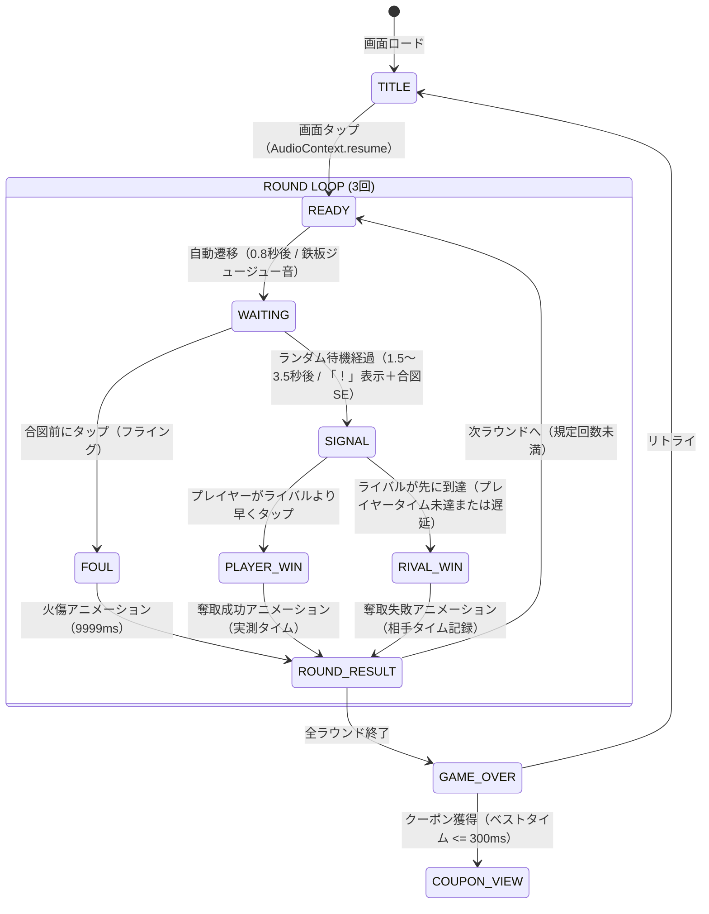

# 仕様書: 海の家 販促ミニゲーム「最後の一本フランクフルト」

## 1. 概要
* **ゲーム名:** 最後の一本フランクフルト（英名: Frankfurt Grab / 30秒刹那の見斬り）
* **目的:** 海の家の店頭で来店客が手軽にプレイ（30〜60秒）し、好成績（300ms以下の反応速度）に応じて割引クーポンを獲得できる販促用Webミニゲーム。
* **ゲーム性:** 星のカービィ「刹那の見斬り」風の瞬間反射神経計測ゲーム。
  * 3ラウンド制で異なるライバル客（R1: 観光客, R2: 海の男, R3: 腹ペコ店長）と鉄板上の「最後の一本」を取り合う。
  * 合図（！）の瞬間に画面をタップ。3回のうちベストタイムが **300ms以下** でクーポン獲得。
* **デザインテイスト:** 8bitレトロゲーム風（ファミコン／ピクセルアート調、ドット絵UI、ピコピコ音）。
* **対象環境:** モバイルブラウザ（iOS Safari / Android Chrome 縦画面最適化）、PCブラウザ。

---

## 2. システム構成・技術スタック
* **フロントエンド:** HTML5, CSS3, JavaScript (Vanilla JS)
* **描画方式:** 低解像度 HTML5 Canvas 2D (240×360px) + CSS等倍スケーリング (`image-rendering: pixelated`)
* **サウンド:** Web Audio API (外部音声ファイル不要の完全プログラム生成：ホワイトノイズ、矩形波、三角波、鋸歯状波)
* **外部連携:** 共通クーポン管理モジュール (`CouponManager`)

---

## 3. ゲーム設定・調整可能パラメータ (`GAME_CONFIG`)

```javascript
const GAME_CONFIG = {
    // 挑戦回数
    maxAttempts: 3,

    // 合図（！）までのランダム待機時間（ミリ秒）
    minWaitTimeMs: 1500,
    maxWaitTimeMs: 3500,

    // クーポン獲得判定基準（ミリ秒：いずれかのライバルに1勝、または480ms以下で合格）
    targetThresholdMs: 480,

    // お手つき（フライング）時のペナルティ記録（ms扱い）
    foulPenaltyMs: 9999,

    // 各ラウンド結果表示の自動待機時間（ミリ秒）
    roundResultDurationMs: 1400,

    // サウンド有効フラグ
    soundEnabled: true,

    // ラウンド別ライバル客定義（ラウンドが進むほど難易度が下がり勝ちやすくなる）
    rivals: [
        { round: 1, name: '腹ペコ店長', icon: '👨‍🍳', reactionTimeMs: 300 }, // 激ムズ
        { round: 2, name: '海の男',   icon: '🏄‍♂️', reactionTimeMs: 380 }, // 中級
        { round: 3, name: 'のんびり客', icon: '👒', reactionTimeMs: 480 }  // 易しい
    ]
};
```

---

## 4. 画面ステートマシン & 遷移フロー



---

## 5. ランク基準 & クーポン連携

### 5.1 ランク判定テーブル
| ランク | ベストタイム基準 | 称号 | 特典 / クーポン条件 |
| :---: | :---: | :--- | :--- |
| **S** | 〜 249 ms | 👑 神速のフランクマスター | **クーポン獲得（バニラアイス または 100円引き）** |
| **A** | 250 〜 350 ms | 🌟 合格！プロの早業 | **クーポン獲得（バニラアイス または 100円引き）** |
| **B** | 351 〜 480 ms | 🍖 一人前！ナイス奪取 | **クーポン獲得（バニラアイス または 100円引き）** |
| **C** | 481 ms 〜 / 全FOUL | 😅 見習いフランク客 | なし（「あと〇〇msでクーポン！」表示） |

### 5.2 クーポン連携インターフェース
```javascript
if (bestTimeMs <= GAME_CONFIG.targetThresholdMs) {
    if (CouponManager.canClaimToday('frankfurt')) {
        CouponManager.claimCoupon('frankfurt');
    }
    const couponUrl = CouponManager.getCouponUrl('frankfurt', {
        score: bestTimeMs,
        rank: rankInfo.rank
    });
}
```

---

## 6. Web Audio API 音響設計

1. **鉄板のジュージュー音 (`playSizzle`)**:
   * 1秒のホワイトノイズバッファを生成し、ループ再生。
   * バンドパスフィルター（中心周波数 2800Hz, Q値 1.2）で高音のパチパチ感を再現。
2. **合図SE (`playSignal`)**:
   * 矩形波（square波）による周波数急上昇（2400Hz → 3400Hz / 0.12秒）。
3. **奪取成功SE (`playGrabSuccess`)**:
   * 8bit風ファミコンアルペジオ（C6 -> E6 -> G6 -> C7 / 各0.06秒）。
4. **火傷・FOUL SE (`playFoul`)**:
   * 鋸歯状波（sawtooth波）による不協和音低周波（140Hz -> 80Hz / 0.3秒）。
5. **勝利ファンファーレ (`playFanfare`)**:
   * 8bitメロディ（G5 -> C6 -> E6 -> G6 / 0.4秒）。
